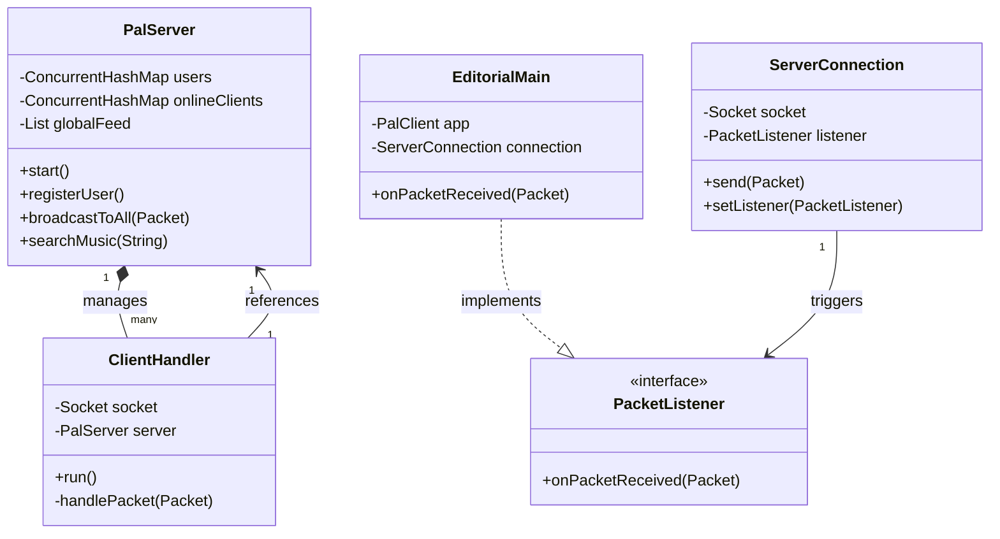

# Pal: LAN Social Ecosystem 
**Project Documentation**

## 1. Introduction
**Pal** (formerly LANSocial) is a high-end, feature-rich Local Area Network (LAN) social media application built in Java. Designed as an integrated campus communication tool, it provides a distributed yet centralized platform for students to chat, collaboratively brainstorm, share large files directly, synchronize music playback, and buy/sell items on a local campus marketplace.

---

## 2. Technology Stack
The project is built emphasizing core Object-Oriented Programming principles without relying on heavy external frameworks like Spring or heavy database ORMs. Everything runs locally on standard Java SE standard libraries.

### **Backend (Server)**
*   **Language**: Java (JDK 21+)
*   **Networking**: `java.net.Socket`, `java.net.ServerSocket` (TCP for strict reliability), `DatagramSocket`, `MulticastSocket` (UDP for zero-config autodiscovery)
*   **Concurrency**: Direct Java Threading (`Runnable`), `Collections.synchronizedList`, `ConcurrentHashMap` for thread-safe state management.
*   **Data Serialization**: Native Java Object Serialization (`ObjectInputStream` / `ObjectOutputStream`) transporting immutable `Packet` objects.

### **Frontend (Client)**
*   **Framework**: JavaFX 
*   **Modules**: `javafx.controls`, `javafx.fxml`, `javafx.media` (for Audio Synchro/Playback)
*   **Styling**: Vanilla CSS (`style.css`)
*   **Concurrency Control**: `Platform.runLater()` for bridging network backend tasks to the JavaFX Application Thread.

---

## 3. Key Features

1.  **Zero-Config Discovery**: Clients automatically discover the active Pal server on the local network using a custom UDP multicast beacon (`230.1.1.1:9091`). Users do not need to memorize IP addresses.
2.  **LAN-Drop (P2P File Transfer)**: Users can directly stream massive files across the LAN using dynamically negotiated direct socket connections, bypassing server traffic bottlenecks.
3.  **The "Vibe" Room**: Server-coordinated audio synchronization. When a user shares a song from iTunes, other online users can "tune in" to hear the playback perfectly synced across all computers.
4.  **Campus Mind-Board**: Real-time collaborative canvas (JavaFX Canvas) where users can draw, brainstorm, and interact simultaneously utilizing low-latency UDP-style packet relay over TCP.
5.  **Campus Marketplace**: An integrated micro-economy. Users can post items for sale with rich UI badges, prices, and customized metadata, all seamlessly blended into the global feed with instant tag filtering.
6.  **Third-Party Integrations**: The Pal Server acts as a proxy gateway to external Web APIs (iTunes, Wikipedia, Open-Meteo, NumbersAPI), safely delivering internet data to local LAN clients without requiring every client to have unfiltered internet access.

---

## 4. Project Structure (Frontend vs Backend)

The project leverages a strict separation of concerns, heavily utilizing the Model-View-Controller (MVC) and Proxy patterns.

```text
Pal/
├── src/
│   ├── model/          ← Shared Data Models & Network Definitions
│   │   ├── Packet.java       - Universal Object transport wrapper.
│   │   ├── Post.java         - Feed posts (Social & Marketplace).
│   │   ├── MusicShare.java   - iTunes track metadata wrapper.
│   │   ├── DrawAction.java   - Collaborative Mind-Board stroke vectors.
│   │   └── FileMetadata.java - P2P LAN-Drop handshake parameters.
│   │
│   ├── server/         ← Backend Architecture
│   │   ├── PalServer.java        - Main thread; state controller & API Gateway.
│   │   ├── ClientHandler.java    - Dedicated worker thread per client connection.
│   │   ├── BeaconServer.java     - UDP Multicast Server announcer.
│   │   └── api/                  - HTTP Client wrappers acting as proxies.
│   │       ├── ITunesAPI.java, WikipediaAPI.java, WeatherAPI.java, NumbersAPI.java
│   │
│   ├── client/         ← P2P & Network Connectors
│   │   ├── PalClient.java           - JavaFX Application Entry.
│   │   ├── ServerConnection.java    - TCP Client loop & Observer Pattern trigger.
│   │   ├── DiscoveryClient.java     - UDP Multicast Listener for auto-connect.
│   │   └── FileTransferManager.java - Dynamic direct ServerSocket/Socket streamers.
│   │
│   └── ui/             ← Frontend View Controllers
│       ├── EditorialMain.java     - Master BorderPane container.
│       ├── EditorialFeed.java     - Marketplace, Feeds, iTunes search invocation.
│       ├── EditorialChat.java     - Direct messages & LAN-Drop initialization.
│       ├── EditorialMindBoard.java- JavaFX Canvas collaborative board.
│       └── EditorialDiscover.java - Read-only external API feeds (Trivia/Wiki).
```

---

## 5. Architectural Class Diagram



---

## 6. Source Code Highlights (In Great Detail)

### 6.1 UDP Multicast Beacon (Zero-Config Discovery)
To prevent users from typing IP addresses, the backend features a `BeaconServer` running on UDP multicast. The server constantly shouts its IP and TCP port to a private group address `230.1.1.1`.
```java
// BeaconServer.java highlighting constant IP pushing
String hostname = InetAddress.getLocalHost().getHostName();
String message = "PAL_SERVER|" + hostname + "|" + serverTcpPort;
byte[] buffer = message.getBytes();
InetAddress group = InetAddress.getByName("230.1.1.1");
DatagramPacket packet = new DatagramPacket(buffer, buffer.length, group, 9091);
socket.send(packet);
```
The Frontend `DiscoveryClient` joins this group. The instant it hears `PAL_SERVER|`, it intercepts the IP, halts its thread, and executes a `Platform.runLater()` callback to auto-populate the JavaFX Login Screen.

### 6.2 Thread-Safe API Proxy Pipeline
The `ClientHandler` operates synchronously (`in.readObject()`). If an API request took 5 seconds, the user's UI socket connection would block. To handle external requests properly, `ClientHandler` delegates them to background thread pools.
```java
// ClientHandler.java delegating Wikipedia API lookup
private void handleWikiLookup(Packet packet) {
    String query = (String) packet.getPayload();
    new Thread(() -> { // Fire-and-forget worker thread avoids blocking socket
        WikiResult result = server.lookupWiki(query);
        send(new Packet(Packet.Type.WIKI_LOOKUP_RESPONSE, result));
    }).start();
}
```

### 6.3 P2P LAN-Drop Handshake
Rather than routing gigabytes of file data through the central server (which crashes Server architectures), Pal uses the server only for *Signaling*.
1. **Alice** sends `FILE_OFFER` (Metadata) to the server, which proxies to **Bob**.
2. **Bob** accepts. Bob's UI spins up a temporary TCP `ServerSocket(0)` (Port 0 finds any free port).
3. **Bob** sends the server a `FILE_ACCEPT` packet containing `[Alice, IP, Bob's Dynamic Port]`.
4. The server shuttles this back to **Alice**.
5. **Alice** connects directly to Bob's IP/Port using `FileTransferManager`, completely bypassing the main Application TCP Server.
*(Reference: `FileTransferManager.java` & `EditorialChat.java` lines 200-260).*

---

## 7. External API Endpoints

The server utilizes standard Java 11+ `HttpClient` functionality to communicate with REST APIs. All responses are manually parsed avoiding heavy JSON libraries (like GSON or Jackson) to keep dependencies at zero.

1.  **Open-Meteo**: `https://api.open-meteo.com/v1/forecast` - Fetches global weather. Free tier without authentication.
2.  **Number/Trivia API**: `http://numbersapi.com/random/date` - Returns random historical facts.
3.  **iTunes Search APi**: `https://itunes.apple.com/search?media=music&limit=15&term={query}` - Returns metadata, JSON parameters, and 30-second `previewUrl` stream lengths. Modality acts as the core of the "Vibe" Room feature.
4.  **Wikipedia REST API**: `https://en.wikipedia.org/api/rest_v1/page/summary/{query}` - Used in the "Encyclopedia Spotlight" discover section to fetch text extractions. Implements the `User-Agent: Pal/5.0` header to conform with Wiki policies.

---

## 8. Conclusion

### Key Achievements
1.  **Massive Scope Completion**: Built an entire campus ecosystem from scratch successfully integrating Real-Time UI, Third-party REST calls, local Multicast Networking, P2P Sockets, and Multimedia audio frameworks.
2.  **Architectural Polish**: Cleanly separated the data transfer layer utilizing the wrapper `Packet` classes and Observer Pattern listeners, drastically reducing coupling.
3.  **Modern Aesthetic Engine**: Successfully executed an ambitious shift away from standard grey generic applications into a heavily CSS-stylized, magazine-themed editorial UI utilizing responsive borders and refined typography.
4.  **Performance Guarantee**: Overcame multi-threading `ConcurrentModificationException` glitches in global lists and successfully achieved Thread-safe array-copy distribution on backend queries.

### Learning Outcomes
*   Deepened understanding of JVM multithreading limitations, particularly exactly how and when to bind updates back to `Platform.runLater()`.
*   Mastered Java Socket programming: both traditional central coordination networks (TCP) and peer-to-peer ad-hoc networks, alongside broadcast architectures (UDP).
*   Grasped advanced Proxy Design Pattern concepts where a monolithic backend server protects constrained clients by acting as a firewall wrapper that talks to REST APIs for them.

---

## 9. References
1.  Oracle Java Documentation: [Java Sockets Tutorial](https://docs.oracle.com/javase/tutorial/networking/sockets/index.html)
2.  JavaFX 8+ Architecture Guide: [JavaFX Application Threading](https://docs.oracle.com/javase/8/javafx/interoperability-tutorial/concurrency.htm)
3.  Open-Meteo Free Weather API: [Open-Meteo Docs](https://open-meteo.com/en/docs)
4.  Apple Services API: [iTunes Search API Documentation](https://developer.apple.com/library/archive/documentation/AudioVideo/Conceptual/iTuneSearchAPI/index.html)
5.  Wikipedia API: [Wikimedia REST API Overview](https://en.wikipedia.org/api/rest_v1/)
